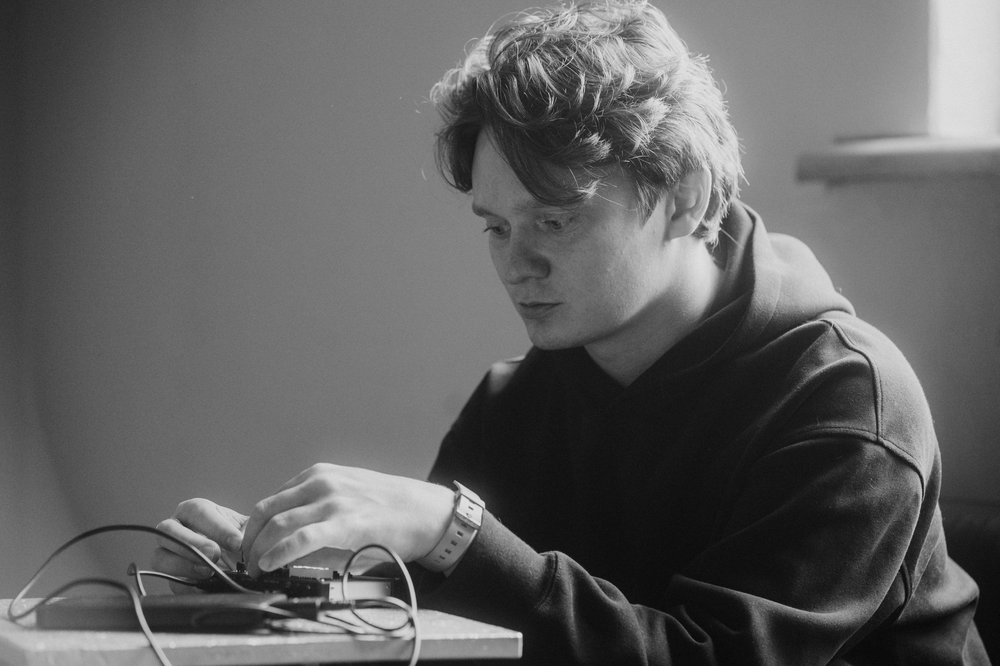

Я междисциплинарный художник.  
Работаю со звуком, объектами, рисунком и инсталляциями.
Это синтезаторы, бумага, дерево, электричество, краски и код.

Мне нравится создавать ситуации без однозначного прочтения и готового смысла, где остаётся возможность прожить собственный опыт.

Я люблю процессы, ошибки и пробы в искусстве.  
Часто работы рождаются из спонтанных мыслей, возникающих при наблюдении окружающего мира.

